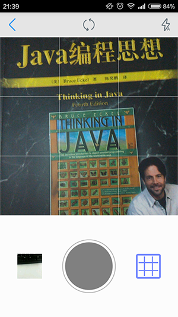
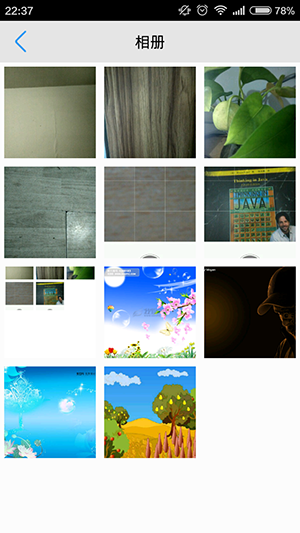

# SquareCameraDemo
## Description
SquareCameraLibrary is a Square Camera.
In SquareCameraLibrary, you can see a SurfaceView of the square, and it will return a square picture for you from the square camera or photo albums.
## Reference
Reference project [SquareCamera](https://github.com/boxme/SquareCamera).
## Quick Start
Omit steps import project and dependencies. and you can request CameraActivity:
```java
Intent intent = new Intent(MainActivity.this, CameraActivity.class);
intent.putExtra(ImageStore.SQUARE_LENGTH_KEY, 600);
//intent.putExtra(ImageStore.SQUARE_EXTRA_OUTPUT_KEY, Uri.fromFile(saveFile));
startActivityForResult(intent, REQUEST_TAKE_PICTURE_CODE);
```
You can set the output image size by ImageStore.SQUARE_LENGTH_KEY filed:
```java
intent.putExtra(ImageStore.SQUARE_LENGTH_KEY, 600);
```
Ways you can set the output pictures by ImageStore.SQUARE_EXTRA_OUTPUT_KEY field. if not, we will return an array of bytes.
```java
intent.putExtra(ImageStore.SQUARE_EXTRA_OUTPUT_KEY, Uri.fromFile(saveFile));
```
Neither the square camera nor the album, get the return image data in onActivityResult method.
```java
@Override
protected void onActivityResult(int requestCode, int resultCode, Intent data) {
    super.onActivityResult(requestCode, resultCode, data);
    if(requestCode == REQUEST_TAKE_PICTURE_CODE && resultCode == RESULT_OK){
        //set ImageStore.SQUARE_EXTRA_OUTPUT_KEY
        //Bitmap bitmap = BitmapFactory.decodeFile(saveFile.getAbsolutePath());
        //if not set. default
        byte[] buffer = data.getByteArrayExtra("data");
        Bitmap bitmap = BitmapFactory.decodeByteArray(buffer, 0, buffer.length);

        show.setImageBitmap(bitmap);
    }else if(resultCode == CameraActivity.RESULT_ALBUMS && requestCode == REQUEST_TAKE_PICTURE_CODE){
        String imagePath = data.getStringExtra("imagePath");
        Glide.with(this)
             .load(imagePath)
             .override(500, 500)
             .into(show);
        }
    }
```
if resultCode equals RESULT_OK, show returned from the square camera. if resultCode equals CameraActivity.RESULT_ALBUMS, show returned from the albums.
## Screenshot
Square Camera View  

  

Albums View  


## Used Tools
Used Glide loader image. Want to know more about Glide. click [Glide](https://github.com/bumptech/glide)